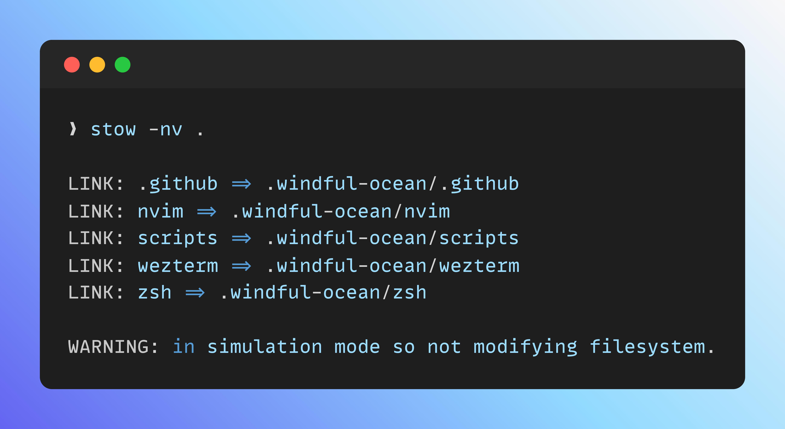

# Windful Ocean 
Hello There 👋! Welcome to my personal repository for storing dotfiles & configuratures. This repository is intended to give you a base to build your own dotfiles & configurations from. In this README, I will explain how you get started using my repository.

> This repo uses `stow` to maintain dotfiles and configurations. However, you may also install the dotfiles and configurations manually.

## Pre-Requisites

> You must be using an Unix system in order to following this tutorial.

Before you begin, make sure you have `stow` installed on your system. You can do so by running the following command:
```bash
brew install stow # MacOs
```
```bash
sudo apt stow # Ubuntu
```
You can check to see `stow` has installed properly by running:

```bash
stow --help
```
Moreover, make sure you have cloned this repository and navigated into its directory.

## Installation

You can use `stow` to automatically copy the dotfiles and configurations into your home directory. Before you begin, **remember to back-up** your existing files.

1. Check to make sure `stow` is doing what it's supposed to using the `-nv` or `--no --verbose` which will simulate the `stow` command without actually running the command. The `.` run's it in the current directory.

```bash
stow -nv .
```

A sample output demonstrating the expected format without errors would be:


If you get any errors, you will have to work through them before proceeding to the next step.

2. If everything looks good, then you can run the the actual `stow` command:
```bash
stow -v . # Stow all Files
stow -v [FILENAME] # Stow a specific file.
```
